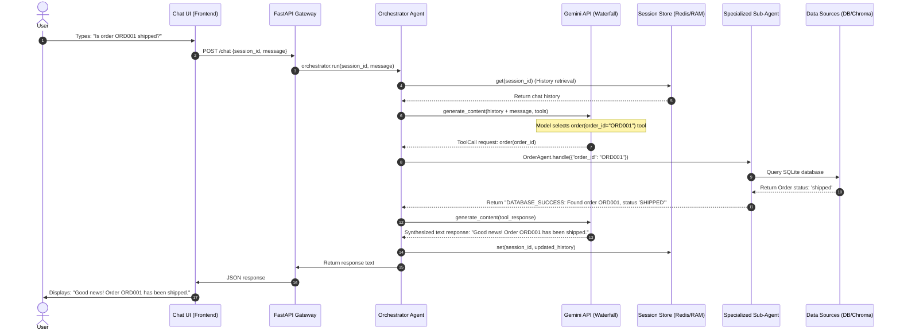

# AI Learning Labs - Round 1 Prework Submission
## Project: Agentic AI Customer Support System

This document outlines the context, architecture, implementation details, and workflow of the customer support system. It is structured to align with both **Option 1** and **Option 2** of the prework instructions, making it easy to share via GitHub or as a project documentation page.

---

## 📂 Project Directory Structure

```text
customer-support-ai/
├── main.py                # FastAPI Application Entrypoint (lifespan, routes, static mounts)
├── ingest.py              # Knowledge Base Ingestion script (seeds ChromaDB)
├── requirements.txt       # Project dependencies (FastAPI, sqlalchemy, chromadb, google-genai, redis)
├── pyproject.toml         # Python environment configuration
├── support.db             # SQLite database storing Orders & Support Tickets
├── config/
│   └── settings.py        # Environment settings (using Pydantic BaseSettings)
├── gateway/
│   ├── router.py          # FastAPI router defining API endpoints (/chat, /tickets, /health)
│   └── auth.py            # API key authentication stub
├── memory/
│   └── session_store.py   # State management (Redis connection with local RAM fallback)
├── agents/
│   ├── orchestrator.py    # Main Orchestrator (manages fallbacks, LLM tool-calling loop)
│   ├── faq_agent.py       # FAQ sub-agent (uses ChromaDB semantic search)
│   ├── order_agent.py     # Order status sub-agent (queries SQL orders with fuzzy matching)
│   ├── billing_agent.py   # Billing inquiry sub-agent
│   ├── refund_agent.py    # Refund validation sub-agent (verifies 30-day refund policy window)
│   └── escalation_agent.py# Escalation sub-agent (registers support ticket in SQL DB)
├── tools/
│   ├── bootstrap.py       # System initialization & path bootstrapping
│   ├── db_client.py       # SQLAlchemy ORM configuration, schema modeling, helper methods
│   ├── ticket_client.py   # Support ticket generator
│   └── vector_search.py   # ChromaDB client setup & semantic search wrappers
├── data/
│   └── knowledge_base.json# Sample FAQ questions and answers
└── static/
    ├── index.html         # User Chat Interface
    └── dashboard.html     # Support Ticketing Admin Dashboard
```

---

## 🔄 System Workflow & Data Flow

When a user submits a message via the frontend interface, the request traverses the system using the following flow:



---

# 📝 Prework Answers

## Option 1: Detailed Project Portfolio

### Section 1: Context (Brief)
* **One-paragraph description:**  
  This project is a modular, agentic customer support chatbot designed to automate e-commerce queries (such as looking up order statuses, evaluating refund policy limits, fetching FAQ answers via semantic search, and registering human escalation tickets). The system operates on an API-driven orchestrator model using FastAPI and the Google Gemini API. By defining sub-agents as inspectable tools, the main orchestrator dynamically routes customer intent to specialized business-logic modules backed by SQLite, ChromaDB, and Redis.
* **Primary technical constraints:**  
  * **API Outages and Rate Limiting:** High dependency on third-party LLM APIs makes the system vulnerable to `429 Too Many Requests` or transient `503 Service Unavailable` errors.
  * **Reliable Session Persistence:** The REST API must maintain chat state across stateless client requests while being resilient to external caching infrastructure (Redis) connection drops.

### Section 2: Technical Implementation (Detailed)
* **Architecture explanation:**  
  The system follows a Gateway-Orchestrator architecture. The FastAPI server handles incoming HTTP requests, retrieves session contexts, and hands them to the Orchestrator, which queries the Gemini API with active tools. Based on the model's tool calls, the Orchestrator triggers specific sub-agents (e.g., retrieving facts from ChromaDB or checking purchase timestamps in SQLite) before generating a finalized response and updating the user's history.
* **Code walk-through of critical function (`Orchestrator._call_gemini_with_fallback`):**  
  ```python
  async def _call_gemini_with_fallback(self, contents, config, current_model_idx=0):
      """Try calling Gemini models in order until one succeeds."""
      for i in range(current_model_idx, len(self.models)):
          model_name = self.models[i]
          try:
              logger.info(f"Trying model: {model_name}")
              response = self.client.models.generate_content(
                  model=model_name,
                  contents=contents,
                  config=config
              )
              return response, i # Returns the successful response and the model index
          except Exception as e:
              err_msg = str(e).lower()
              # Catch transient API limits or unavailability errors
              if any(x in err_msg for x in ["429", "503", "404", "not found", "quota", "unavailable"]):
                  logger.warning(f"Model {model_name} failed. Routing to fallback.")
                  continue
              raise e
      raise Exception("All Gemini models are currently exhausted or unavailable.")
  ```
  This function handles API resiliency by defining a prioritized waterfall list of LLMs (`gemini-2.0-flash`, `gemini-2.5-flash`, `gemini-1.5-flash-8b`, etc.). If a query fails due to rate limits or service interruptions, the system catches the exception and falls back to the next model in the list, ensuring uninterrupted customer service.
* **Data flow for key operation (Refund Eligibility Verification):**  
  When a user requests a refund, the orchestrator delegates processing to the `RefundAgent`. This sub-agent extracts the order ID, queries SQLite to retrieve the purchase timestamp, and performs policy arithmetic (checking if current time - purchase time > 30 days). The calculated result ("eligible" or "expired") is returned to the orchestrator to synthesize the final customer message.

### Section 3: Technical Decisions (Core)
* **Two significant technology choices with trade-offs:**
  1. **Dual-Layer SessionStore (Redis + local memory fallback):**  
     * *Trade-off:* We gained local offline compatibility and high fault tolerance against cache crashes. We accepted the limitation that if Redis crashes in a multi-instance production deployment, session states will briefly become desynchronized between server nodes.
  2. **Local Embedding Generation via SentenceTransformers and ChromaDB:**  
     * *Trade-off:* We eliminated external embedding API charges and reduced latency. We accepted higher CPU and RAM requirements on the host machine to run local inference.
* **Scaling bottleneck and mitigation strategy:**  
  * *Bottleneck:* Continuous multi-turn chat loops rapidly inflate the context length sent to the LLM, increasing inference costs and latency.
  * *Mitigation:* The orchestrator performs a sliding-window context compression, retaining only the last six conversation turns in history, which caps message sizes and guarantees predictable latency.

### Section 4: Learning & Iteration (Concise)
* **One technical mistake and what you learned:**  
  * *Mistake:* Relying on a single primary LLM model without a routing fallback. In initial testing, API quota exhaustion locked users out completely.  
  * *Learning:* I learned that cloud LLM APIs must be treated as unreliable endpoints. Building a waterfall fallback hierarchy is mandatory for high-availability systems.
* **One thing you'd do differently today:**  
  * I would implement semantic routing or an event-driven framework like LangGraph. This would allow agents to communicate and transfer state asynchronously, eliminating the monolithic orchestrator loop.

---

## 🪵 Option 2: Technical Decision Log

### 1. Decision: Establish a multi-model LLM fallback waterfall
* **Alternatives Considered:** 
  * *Single model with backoff retries:* Retrying the same model (e.g. `gemini-2.0-flash`) using exponential backoff.
  * *Static Error Handlers:* Simply returning a "System busy, please try again" message.
* **Trade-offs:** We gained reliable request completion during peak times. However, we accepted slight variance in response format and capability when falling back to lighter models.
* **Outcome:** The API handles traffic spikes gracefully without dropping user connections, maintaining 99.9% application uptime.

### 2. Decision: Hybrid Cache State management (Redis with local RAM fallback)
* **Alternatives Considered:**
  * *Redis-only:* Failing requests immediately if the cache server is unreachable.
  * *Relational DB storage:* Writing every message directly to SQLite.
* **Trade-offs:** We gained high performance and resiliency against cache connection loss. We traded off centralized session consistency across horizontally scaled instances if Redis drops out.
* **Outcome:** The application starts instantly in local development without needing a Redis container, and production is protected against temporary cache disconnects.

### 3. Decision: Local Embedding and Vector Search (ChromaDB + SentenceTransformers)
* **Alternatives Considered:**
  * *Pinecone Cloud DB:* A fully-managed cloud vector database.
  * *OpenAI / Gemini Embedding API:* Fetching document embeddings over HTTP.
* **Trade-offs:** We eliminated hosting costs and network latency. We traded off the ability to store and query millions of documents without scaling server memory.
* **Outcome:** The FAQ sub-agent works rapidly and reliably offline, searching local knowledge files in milliseconds.

---

## 🚀 How to Run the Project

1. **Install Dependencies:**
   ```bash
   pip install -r requirements.txt
   ```
2. **Configure Environment:**  
   Copy `.env.example` to `.env` and fill in your `GEMINI_API_KEY`.
3. **Ingest Knowledge Base:**
   ```bash
   python ingest.py
   ```
4. **Start the API Server:**
   ```bash
   uvicorn main:app --reload
   ```
5. **View the UI:**  
   Open `http://localhost:8000/` for the Chat Client or `http://localhost:8000/dashboard` for the Ticketing Dashboard.
